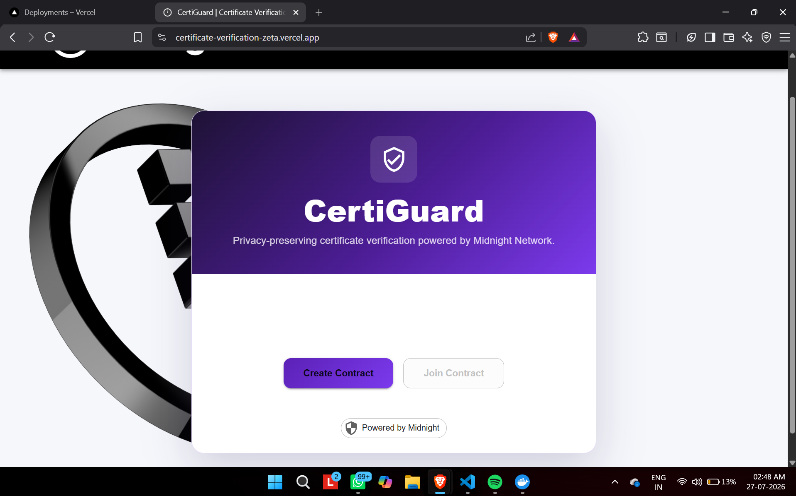
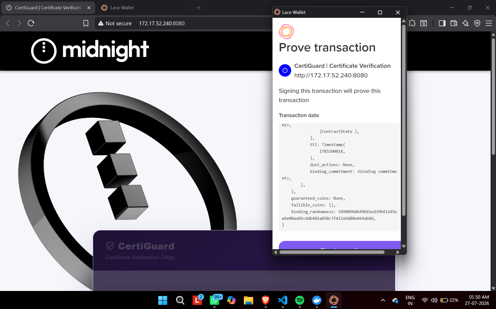

# 🛡️ CertiGuard

### Privacy-Preserving Certificate Verification on Midnight Network

CertiGuard is a decentralized certificate verification DApp built on the **Midnight Network**. It enables organizations to issue, verify, and revoke certificates using cryptographic fingerprints while reducing the need to expose complete certificate information on-chain.

The application combines **Compact smart contracts**, **Midnight.js**, **React**, **TypeScript**, and **Lace Wallet** to provide a privacy-focused and tamper-resistant certificate verification system.

---

## 🌍 Live Demo

**Vercel:** **Pending**

> The live CertiGuard Vercel URL will be added after frontend deployment.

---

## 📜 Contract Address

| Network | Contract Address |
|---|---|
| Midnight Preprod | **Pending** |

> The final Midnight Preprod contract deployment is pending. The deployed contract address will be added here after successful deployment.

---

## 📌 Problem Statement

Fake academic and professional certificates can be difficult and time-consuming to verify using traditional systems.

Centralized certificate databases may also introduce problems such as:

- Single points of failure
- Dependence on the issuing organization
- Manual verification processes
- Possibility of record manipulation
- Exposure of unnecessary personal information

CertiGuard addresses these challenges by using blockchain-based verification while representing certificate information through a cryptographic fingerprint.

---

## ✨ Features

- 📜 Issue certificates through a Midnight smart contract
- 🔍 Verify certificate authenticity
- 🚫 Revoke previously issued certificates
- 🔐 SHA-256 certificate fingerprinting
- 🌙 Midnight Network integration
- 👛 Lace Wallet integration
- 🛡️ Privacy-preserving issuer authentication
- 🔗 Join an existing verification contract
- 💻 Responsive React user interface
- ⏳ Transaction loading states
- ⚠️ Error handling and user feedback
- ⛓️ On-chain certificate status management

---

## 📸 UI Screenshots

### CertiGuard Home Page



### Lace Wallet Integration



> Screenshots demonstrate the CertiGuard interface and Lace Wallet integration.

---

## 🛠️ Tech Stack

| Technology | Purpose |
|---|---|
| **Midnight Network** | Privacy-preserving blockchain |
| **Compact** | Smart contract development |
| **Midnight.js** | DApp and blockchain integration |
| **React** | Frontend development |
| **TypeScript** | Application logic |
| **Material UI** | UI components and styling |
| **Vite** | Frontend build tooling |
| **Lace Wallet** | Midnight wallet integration |
| **SHA-256** | Certificate fingerprint generation |
| **Node.js** | JavaScript runtime |
| **npm** | Package management |
| **Git & GitHub** | Version control |
| **Vercel** | Frontend deployment |

---

## 🏗️ Architecture

CertiGuard consists of four main application components:

```text
                     ┌─────────────────────┐
                     │      CertiGuard     │
                     │      React UI       │
                     └──────────┬──────────┘
                                │
                                ▼
                     ┌─────────────────────┐
                     │   Midnight.js API   │
                     └──────────┬──────────┘
                                │
                   ┌────────────┴────────────┐
                   ▼                         ▼
          ┌─────────────────┐       ┌─────────────────┐
          │   Lace Wallet   │       │ Compact Contract│
          │ Authentication  │       │ Issue / Verify  │
          └─────────────────┘       │    / Revoke     │
                                    └────────┬────────┘
                                             │
                                             ▼
                                    ┌─────────────────┐
                                    │ Midnight Network│
                                    └─────────────────┘
```

### Application Components

- `contract/` — Compact smart contract implementing certificate operations
- `api/` — Midnight.js integration between the contract and application
- `certificate-verification-cli/` — CLI and Midnight network utilities
- `certificate-verification-ui/` — React/TypeScript CertiGuard frontend

---

## 🔐 How CertiGuard Works

### 1. Certificate Input

The issuer enters certificate information such as:

```text
Student Name | Course | Certificate ID | Issue Date
```

### 2. SHA-256 Fingerprint

The frontend converts the certificate information into a SHA-256 fingerprint.

```text
Certificate Information
          ↓
       SHA-256
          ↓
Cryptographic Fingerprint
          ↓
 Midnight Smart Contract
```

This allows certificate verification to use a deterministic fingerprint rather than relying on the complete certificate text as the verification identifier.

### 3. Issue Certificate

The certificate fingerprint is submitted through the application to the Compact smart contract.

The contract records the certificate state as valid.

### 4. Verify Certificate

A verifier enters the certificate information.

CertiGuard generates the SHA-256 fingerprint again and checks the certificate through the smart contract.

For a valid certificate:

```text
✅ Genuine Certificate
```

For an invalid, modified, or revoked certificate:

```text
❌ Fake, Revoked, or Incorrect Certificate
```

### 5. Revoke Certificate

An authorized issuer can revoke an issued certificate.

After revocation, the certificate is no longer considered valid.

---

# 🚀 Installation & Setup

## Prerequisites

Before running CertiGuard, install:

- **Git**
- **Node.js**
- **npm**
- **WSL** if developing on Windows
- **Docker Desktop**
- Midnight development dependencies
- A Chromium-based browser
- **Lace Wallet** with Midnight support

For blockchain transactions, access to the **Midnight Preprod** environment is required.

---

## 1. Clone the Repository

```bash
git clone https://github.com/CipherGriffin07/certificate-verification.git
```

Enter the project:

```bash
cd certificate-verification
```

---

## 2. Select the Node.js Version

If using NVM:

```bash
nvm use
```

If the required Node version is not installed:

```bash
nvm install
nvm use
```

---

## 3. Install Root Dependencies

```bash
npm install
```

---

## 4. Install Contract Dependencies

```bash
cd contract
npm install
cd ..
```

---

## 5. Install API Dependencies

```bash
cd api
npm install
cd ..
```

---

## 6. Install CLI Dependencies

```bash
cd certificate-verification-cli
npm install
cd ..
```

---

## 7. Install Frontend Dependencies

```bash
cd certificate-verification-ui
npm install
cd ..
```

---

# 🔨 Build the Project

## Build Contract

```bash
cd contract
npm run build
cd ..
```

## Build API

```bash
cd api
npm run build
cd ..
```

## Build CLI

```bash
cd certificate-verification-cli
npm run build
cd ..
```

## Build Frontend

```bash
cd certificate-verification-ui
npm run build
cd ..
```

---

# 💻 Running the Frontend

Move to the frontend directory:

```bash
cd certificate-verification-ui
```

Build the application:

```bash
npm run build
```

Start the production build locally:

```bash
npm run start
```

The terminal will display a local address similar to:

```text
http://127.0.0.1:8080
```

Open the displayed address in your browser.

> The exact address or port may vary depending on your local environment.

---

# 👛 Lace Wallet Setup

CertiGuard uses a Midnight-compatible wallet for blockchain interactions.

1. Install Lace Wallet in a Chromium-based browser.
2. Open Lace Wallet.
3. Configure Midnight support.
4. Select the **Preprod** network.
5. Allow the wallet to synchronize completely.
6. Open the CertiGuard application.
7. Click **Create Contract** or **Join Contract**.
8. Authorize the application when Lace Wallet requests permission.
9. Review and approve the required transaction when prompted.

---

# 🌙 Midnight Configuration

Current development network:

```text
Midnight Preprod
```

The application communicates with Midnight infrastructure through Midnight.js providers.

Proof generation may use the configured Midnight proof-server environment.

---

# 📜 Smart Contract

The main Compact contract is located at:

```text
contract/src/certificate-verification.compact
```

The certificate verification contract implements three main operations:

```text
issueCertificate
verifyCertificate
revokeCertificate
```

### `issueCertificate`

Registers the cryptographic fingerprint of certificate information.

### `verifyCertificate`

Checks certificate information against the current contract state.

### `revokeCertificate`

Allows an authorized issuer to revoke a valid certificate.

---

# 🔒 Privacy Model

Privacy is a core design goal of CertiGuard.

## Public Information

Information required by the contract may include:

- Certificate fingerprint/hash
- Certificate status
- Issuer public identifier
- Contract state

## Private Information

Sensitive issuer information is maintained in private state rather than intentionally exposed publicly.

## Privacy-Preserving Authorization

The application uses Midnight's private-state and witness mechanism for issuer authorization.

This enables authorization logic without requiring the issuer's secret itself to be deliberately published as public certificate data.

---

# 📁 Project Structure

```text
certificate-verification/
│
├── api/
│   └── src/
│
├── certificate-verification-cli/
│   └── src/
│
├── certificate-verification-ui/
│   ├── public/
│   └── src/
│       ├── components/
│       ├── config/
│       ├── contexts/
│       └── hooks/
│
├── contract/
│   └── src/
│       ├── certificate-verification.compact
│       ├── index.ts
│       └── witnesses.ts
│
├── screenshots/
│   ├── certiguard-home.png
│   └── lace-wallet.png
│
├── README.md
├── package.json
└── package-lock.json
```

---

# 🖥️ Using CertiGuard

## Create a Verification Contract

Open CertiGuard and click:

```text
Create Contract
```

Authorize the application through the connected Lace Wallet.

---

## Join an Existing Contract

Click:

```text
Join Contract
```

Enter the address of an existing CertiGuard contract.

---

## Issue a Certificate

Enter certificate information such as:

```text
Student Name | Blockchain Development | CERT-001 | 2026
```

Click:

```text
Issue Certificate
```

CertiGuard generates the certificate fingerprint and submits the operation through the DApp.

---

## Verify a Certificate

Enter the same certificate information and click:

```text
Verify
```

A successful verification displays:

```text
✅ Genuine certificate
```

An invalid or revoked certificate displays:

```text
❌ Fake, revoked, or incorrect certificate
```

---

## Revoke a Certificate

When the connected wallet is authorized as the issuer and the certificate is valid, click:

```text
Revoke
```

The certificate state is changed to revoked.

---

# ☁️ Vercel Deployment

The CertiGuard frontend is intended to be deployed using Vercel.

**Live URL:** **Pending**

The public Vercel deployment URL will be added here after successful frontend deployment.

---

# ⚠️ Current Deployment Status

| Component | Status |
|---|---|
| Compact Smart Contract | ✅ Implemented |
| API Integration | ✅ Implemented |
| CLI | ✅ Implemented |
| CertiGuard Frontend | ✅ Implemented |
| Lace Wallet Integration | ✅ Implemented |
| Local Build | ✅ Working |
| Midnight Preprod Contract Address | ⏳ Pending |
| Vercel Live Deployment | ⏳ Pending |

> No fabricated contract address or deployment URL is included. Pending items will be updated after successful deployment.

---

# 🧪 Development

After making frontend changes:

```bash
cd certificate-verification-ui
npm run build
npm run start
```

To commit changes:

```bash
git add .
git commit -m "describe your changes"
git push
```

---

# 🎯 Future Improvements

- Multiple certificates per issuer
- Institution dashboard
- QR-code certificate verification
- Certificate PDF upload and fingerprinting
- Batch certificate issuance
- Multiple issuer support
- Verification history
- Decentralized identity integration
- Public verification portal
- Production Midnight deployment

---

# 👩‍💻 Author

**Snehali Dey**

GitHub: **CipherGriffin07**

---

# 📄 License

This project was developed as a demonstration of privacy-preserving certificate verification using the Midnight Network.